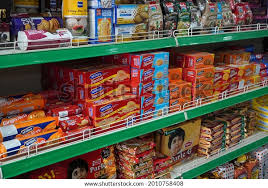
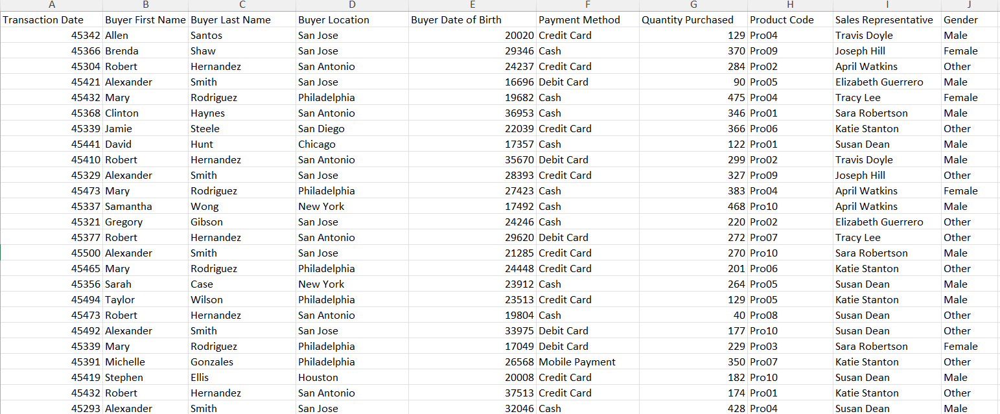
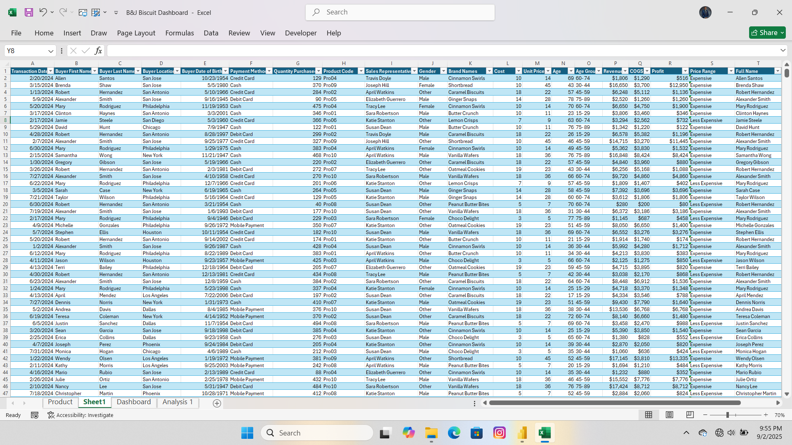

# GROCERIES-SALES-DASHBOARD
## Project Summary

An interactive sales dashboard built to visualize product performance, revenue trends and profitability across stores, products, and customer segments. Key features include KPI cards (Quantity Sold, Total COGS, Total Revenue, Total Profit, % Profit Margin), time-based trend visuals (monthly, weekly, quarterly), location & product tiles, payment-method slicers, and quick insight cards (top brand, top location, top customer, top salesperson, profitable age group). The dashboard was produced using Excel / Power BI (specify which), with data cleaning performed in Power Query and business measures implemented in DAX / Excel formulas.
### Quick Insight
- The dashboard provides a **summary view of performance metrics** (likely sales, revenue, customers, or operations).
- It uses **visuals and charts** for quick interpretation, showing **comparisons, progress, and trends** over time.
- Key metrics are presented at the top (KPIs), supported by charts that explain **distribution, breakdowns, or progress vs. targets**.
- The overall design is meant for **decision-making at a glance** without diving into raw data.
###  Purpose
- To **track and monitor key business performance indicators (KPIs)**.
- To **highlight trends, gaps, and progress** against targets.
- To **simplify complex data** into clear visuals for reporting.
### Audience
- **Business executives/managers** who need quick updates.
- **Data analysts** for deeper interpretation and validation.
- **Stakeholders or clients** to showcase performance understandably.
### Outcome
- Faster **data-driven decision-making**.
- Clear identification of **areas needing attention** (growth opportunities or underperformance).
- **Improved communication** of performance to non-technical stakeholders.
- Ability to **monitor progress over time** and align strategies.
## Quick preview
Here is the snapshot of the dashboard

Click here to interact with the dashboard: [here](B&J_Biscuit_Dashboard2.xlsm)
## Key performance indicators (KPIs) and Cards
Each KPI is implemented as a live cell (card) that reads from the clean data/Pivot/measure.
- Quantity Sold
- Total COGS-Meaning Total Cost of Goods Sold
- Total Profit
- %Profit Margin
- Profitable Brand
- Profitable Location
- Profitable Customer
- Top Salesperson
- Profitable Age Group
## Slicers includes
- Location
- Payment Method
## Data — raw & clean
**Raw Data**                               
original transaction data.
 
[Downloadhere](Raw_Data.xlsx)

**Cleaned Data**
cleaned and enriched dataset for the dashboard.

[Downloadhere](Cleaned_data.xlsm)
## Key Insights from B&J Groceries Dashboard
### 1. **Overall KPIs**
- **Quantity Sold:** **3,050,309 units**
- **Total COGS:** **$34,783,050**
- **Total Revenue:** **$61,567,883**
- **Total Profit:** **$26,784,833**
- **Profit Margin:** **44%**
The business maintains a strong **profitability profile (44% margin)**, showing efficient cost management.
### 2. **Profitable Brand**
- **Shortbread** emerged as the **most profitable brand**, driving top-line and bottom-line performance.
### 3. **Profitable Location**
- **Chicago** recorded the **highest profitability** among all regions, positioning it as the strongest performing location.
### 4. **Profitable Customer**
- **Robert Hernandez** was identified as the **most profitable customer**, showing the importance of high-value clients in driving revenue.
### 5. **Top Salesperson**
- **Travis Doyle** led sales performance, standing out as the **top-performing salesperson**.
### 6. **Profitable Age Group**
- * Customers aged **60–74** represented the **most profitable segment**, indicating strong loyalty and spending power among older customers.
### 7. **Revenue Trends**
- **Quarterly Basis:**
  - **Q1:** $22M
  - **Q2:** $22M
  - **Q3:** $12M
  - **Q4:** $6M
Revenue peaked in **Q1 & Q2 ($22M each)** but declined significantly in **Q3 and Q4**.
### **Monthly Basis:**
- **January, May, and August** were the **top performing months**, together generating **37.4% of total revenue**.
### **Weekly Basis:**
- **Sunday, Monday, Tuesday, and Wednesday** each generated around **$9M**, making weekdays more profitable than weekends.
- **Weekend revenue:** $17M
- **Weekday revenue:** $45M
Weekdays accounted for the majority of sales.
### Summary Outcome
The dashboard shows that:
- The business achieved **$61.5M revenue with a 44% profit margin**.
- **Shortbread (brand)**, **Chicago (location)**, **Robert Hernandez (customer)**, and **Travis Doyle (salesperson)** drive profitability.
- The **60–74 age group** is the most valuable demographic.
- Revenue is **seasonal**, with strong Q1 & Q2 and weak Q3 & Q4.
- **Weekdays clearly outperform weekends**, both in sales volume and revenue contribution.

##  Informed Decisions & Recommendations
### 1. **Brand Strategy**
- **Insight:** *Shortbread* is the most profitable brand.
- **Decision:** Focus marketing, promotions, and inventory stocking on Shortbread to maximize profit.
- **Recommendation:** Expand product lines or introduce variations under Shortbread to leverage brand strength.
### 2. **Location Performance**
- **Insight:** *Chicago* is the most profitable location.
- **Decision:** Allocate more resources, advertising, and distribution support to Chicago.
- **Recommendation:** Use Chicago as a model to replicate success in weaker-performing regions.
### 3. **Customer Segmentation**
- **Insight:** *Robert Hernandez* is the top customer; customers aged **60–74** drive the most profit.
- **Decision:** Strengthen loyalty programs and personalized offers for older customers and high-value clients.
- **Recommendation:** Design senior-friendly promotions and premium offers tailored to high spenders like Robert Hernandez.
### 4. **Salesforce Optimization**
- **Insight:** *Travis Doyle* is the top-performing salesperson.
- **Decision:** Recognize and reward top performers to boost morale.
- **Recommendation:** Share Travis’s sales strategies across the team through training and mentorship.
### 5. **Revenue Seasonality**
- **Insight:** Revenue peaks in **Q1 & Q2 ($22M each)** but drops in **Q3 & Q4**.
- **Decision:** Plan inventory and promotions around seasonal demand.
- **Recommendation:** Investigate causes of low Q3–Q4 sales (holidays, market shifts, competition) and launch promotional campaigns in slow months.
### 6. **Weekday vs Weekend Sales**
- **Insight:** Weekdays contribute **$45M** revenue vs **$17M** on weekends.
- **Decision:** Prioritize weekday promotions and campaigns.
- **Recommendation:** Develop targeted weekend offers to balance sales across the week.
###  Overall Strategic Recommendation
B&J Groceries should:
 1. **Double down on strong performers** (Shortbread, Chicago, 60–74 age group, Travis Doyle).
 2. **Mitigate weak areas** by boosting Q3–Q4 performance and improving weekend sales.
 3. **Adopt customer-centric strategies** (loyalty rewards, personalized marketing, senior-friendly offers).
 4. **Replicate successful practices** across underperforming brands, regions, and sales staff.

## 👨‍💻 Author
### Folagbade Olatunbosun Samuel
- 💼 LinkedIn:https://www.linkedin.com/in/olatunbosun-folagbade-559151243/
- 📧 Email:Folagbadeolatunbosun@gmail.com

