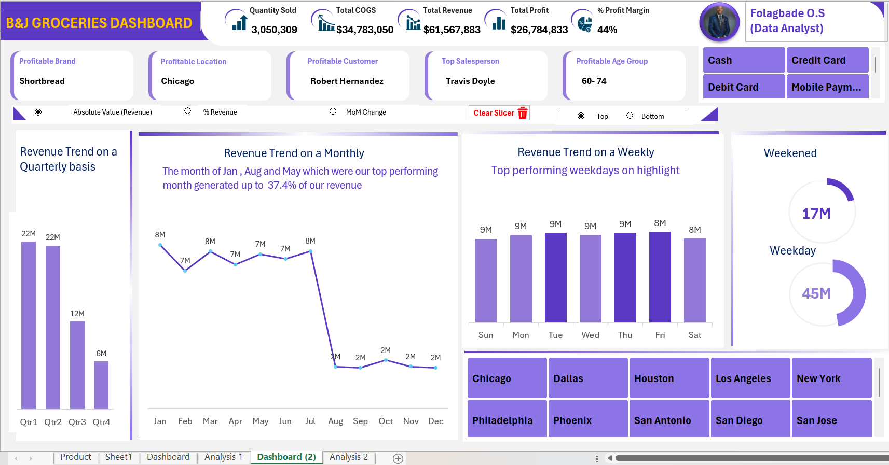

# GROCERIES-SALES-DASHBOARD
## Project Summary

An interactive sales dashboard built to visualize product performance, revenue trends and profitability across stores, products, and customer segments. Key features include KPI cards (Quantity Sold, Total COGS, Total Revenue, Total Profit, % Profit Margin), time-based trend visuals (monthly, weekly, quarterly), location & product tiles, payment-method slicers, and quick insight cards (top brand, top location, top customer, top salesperson, profitable age group). The dashboard was produced using Excel / Power BI (specify which), with data cleaning performed in Power Query and business measures implemented in DAX / Excel formulas.
### Quick Insight
- The dashboard provides a **summary view of performance metrics** (likely sales, revenue, customers, or operations).
- It uses **visuals and charts** for quick interpretation, showing **comparisons, progress, and trends** over time.
- Key metrics are presented at the top (KPIs), supported by charts that explain **distribution, breakdowns, or progress vs. targets**.
- The overall design is meant for **decision-making at a glance** without diving into raw data.
###  Purpose
- To **track and monitor key business performance indicators (KPIs)**.
- To **highlight trends, gaps, and progress** against targets.
- To **simplify complex data** into clear visuals for reporting.
### Audience
- **Business executives/managers** who need quick updates.
- **Data analysts** for deeper interpretation and validation.
- **Stakeholders or clients** to showcase performance understandably.
### Outcome
- Faster **data-driven decision-making**.
- Clear identification of **areas needing attention** (growth opportunities or underperformance).
- **Improved communication** of performance to non-technical stakeholders.
- Ability to **monitor progress over time** and align strategies.
## Quick preview
Here is the snapshot of the dashboard

Click here to interact with the dashboard: [here](B&J_Biscuit_Dashboard2.xlsm)

